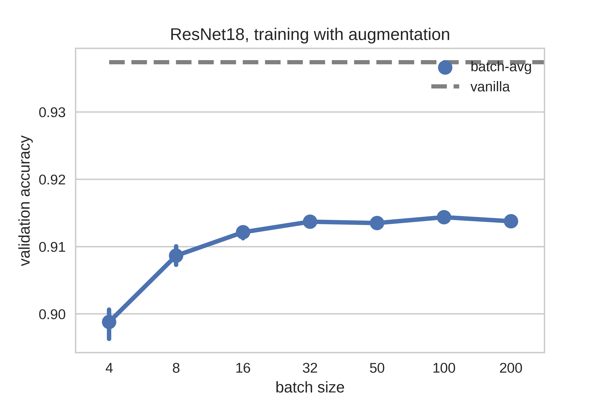

# StochBN
Experiments and StochBN implementation for pytorch.

# Experiments

* `validation_exp.py` -- main experiment, comparison test accuracy with different BN strategy
* `batch_avg.py` -- averaging test predictions through many batches with BN in training mode (mean and variance compute from batch).
* `train_collected_stats.py` -- train network and during training switch BN layers to test mode (use collected mean and variance)

# Results

1. Test accuracy on CIFAR10 dataset with different BN strategies (100 tries for random) `validation_exp.py`:

	* __ResNet18__
    <table>
      <tr>
        <th>mean \ variance</th>
        <th>vanilla</th>
        <th>mean</th>
        <th>random</th>
      </tr>
      <tr>
        <td>vanilla</td>
        <td>0.9367</td>
        <td>0.9367</td>
        <td>0.9376</td>
      </tr>
      <tr>
        <td>mean</td>
        <td>0.9367</td>
        <td>0.9367</td>
        <td>0.9376</td>
      </tr>
      <tr>
        <td>random</td>
        <td>0.9374</td>
        <td>0.9377</td>
        <td>0.9378</td>
      </tr>
    </table>
     

	* __ResNet34__
    <table>
      <tr>
        <th>mean \ variance</th>
        <th>vanilla</th>
        <th>mean</th>
        <th>random</th>
      </tr>
      <tr>
        <td>vanilla</td>
        <td>0.9406</td>
        <td>0.9406</td>
        <td>0.9404</td>
      </tr>
      <tr>
        <td>mean</td>
        <td>0.9406</td>
        <td>0.9406</td>
        <td>0.9409</td>
      </tr>
      <tr>
        <td>random</td>
        <td>0.9407</td>
        <td>0.9406</td>
        <td>0.9406</td>
      </tr>
    </table>
     

	* __ResNet50__
    <table>
      <tr>
        <th>mean \ variance</th>
        <th>vanilla</th>
        <th>mean</th>
        <th>random</th>
      </tr>
      <tr>
        <td>vanilla</td>
        <td>0.94</td>
        <td>0.94</td>
        <td>0.9399</td>
      </tr>
      <tr>
        <td>mean</td>
        <td>0.94</td>
        <td>0.94</td>
        <td>0.94</td>
      </tr>
      <tr>
        <td>random</td>
        <td>0.9399</td>
        <td>0.94</td>
        <td>0.9399</td>
      </tr>
    </table>
     

2. Comparison of BatchNorm strategies and data augmentation (random crop and flip) on accuracy:
	

# Acknowledgement
* Thanks https://github.com/kuangliu for models https://github.com/kuangliu/pytorch-cifar
