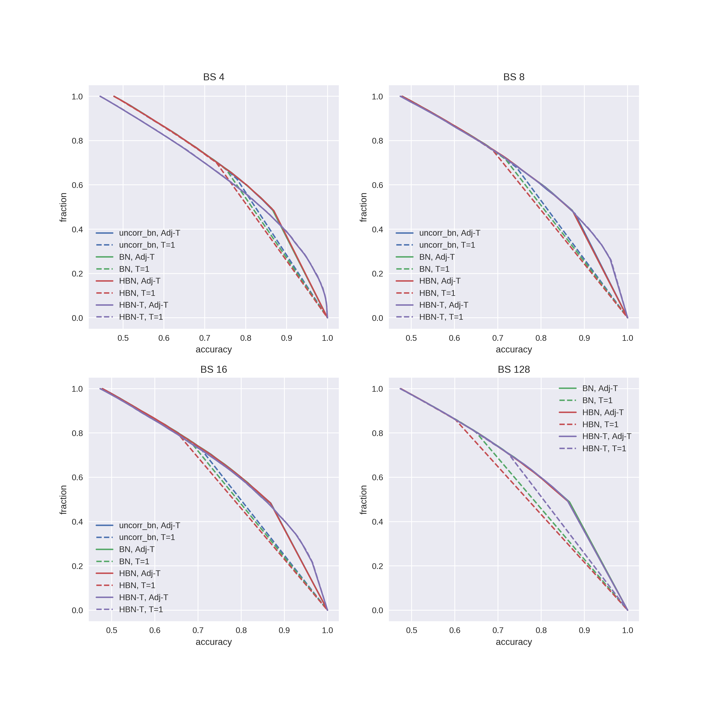

# Experiments Result

All models trained with vanilla batchnorm.

__Models__:
* `BN` -- vanilla BN with one refernce batch (from training data) for statistics on each layer
* `uncorr_bn` -- the same as `BN`, but with different references batches for each layer
* `HBN` -- use approximate distributions $r(\mu), r(\sigma)$ for ensembling
* `HBN-T` -- the same as `HBN` but additional tuning of $r$ after training NN with fixed network parameters.

__Adjust Temperature__

Flaged as `Adj-T`.

To adjust temperature for ensemble I used the same temperature for each model and maximize NLL for whole ensemble.
NLL was computed for using first 1k objects from test set, plots for the other 4k. Optimize NLL using ternary search on [0.0001, 100]. 

## CIFAR5 Uncertainty estimation (Ensembles)

Watch `resnet18-plots.ipynb` for further details.

Unknown classes uncertainty estimation with CIFAR5.
CDF of predictive distributions entropy plotted. 

### ResNet18 

### VGG11-0.5 

## Calibration Plot

Watch `resnet18-plots.ipynb` for further details.

Concatenate known (4k) and unknown (4k) test objects and select objects by thresholding on confedence level (max probability). For each threashold estimate accuracy (0 for unknown class) and fraction of accepted objects.

### ResNet18

### VGG11-0.5

